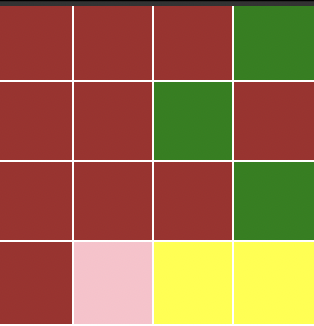

# Chicken That Has One Life
## CELLS and RULES
* pick cell -> chicken (can eat any seed)
* blue cell -> chick (only can eat green seed)
* green cell -> green seed (both chicken and chick can it)
* yellow cell ->  yellow seed (only chickens can it)

**NOTE**
* Normally this game follow the rule of one step at a time, but there is a special cause when the chicken cell can breed and at the same time eat, so the chicken cell will firstly eat and than breed

## SIMULATION
# Chicken cell can eat both yellow and green seeds

# If the pink cell eat more than 6 seeds it dies immediately

# The chicken cell starts to breed after eating to seeds cells, and it spawns the chick randomly around here 8 cells

# The chick cell becames a chicken cell after eating 3 green seeds

